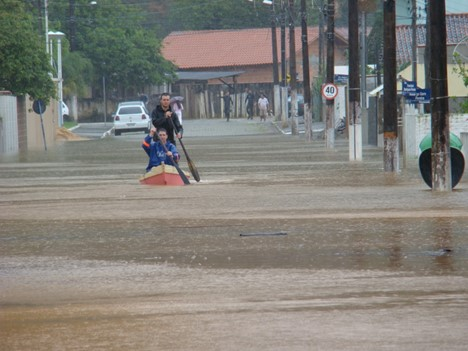
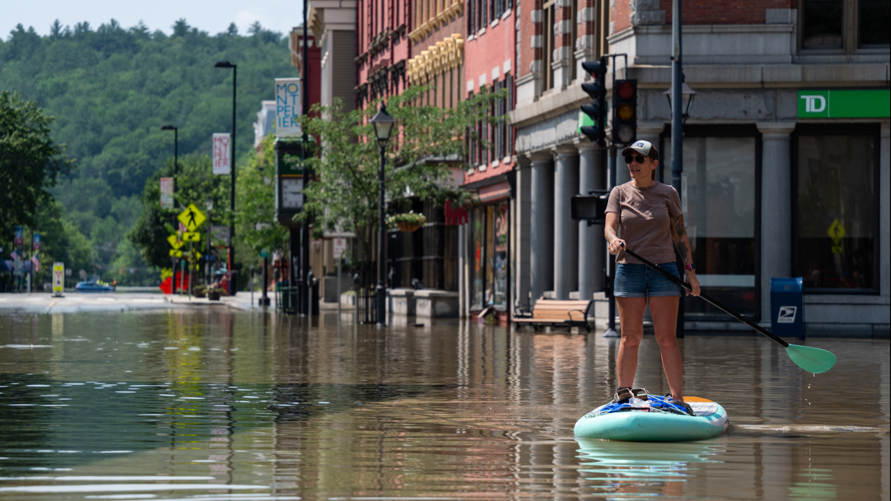

  

<h2 align="center">Cyber Security System Engineering - Final Project</h2>

## 📝 Table of Contents

- [About the Project](#about)
- [Scenario](#scenario_desc)
- [Project Methodology](METHODOLOGY.md)
- [Solution](SOLUTION_DESCRIPTION.md)
- [Deliverables](DELIVERABLES.md)
- [License](/LICENSE)
- [Course Material](tec-course)

## 🧐 About the Project 

Cybersecurity is a significant concern for any cyber-physical system design nowadays, and the content of this course is not just helpful; it's essential for professionals working in designing, building, and testing those systems. 

Cyber Security System Engineering course aims to address cybersecurity from the standpoint of systems engineers, introducing core principles for designing and managing resilient and robust systems by understanding how to incorporate security into a system lifecycle. The course covers system assurance, security design, threat modeling, and Secure Lifecycle Development Framework (SDLC), using a theoretical and practical perspective for assessing system vulnerabilities and handling each situation during the system's lifecycle. 

The course is designed to confront students with real problems, exploiting their critical thinking and problem-solving capabilities using the foundations learned in class. It allows them to analyze the privacy and security of real and complex systems. 

A problem situation is posted as the desired architecture to perform this task. Also, a set of code templates is provided. These templates contain the solution's skeleton, which aims to give a more concrete idea about the solution.

The student will analyze the suggested solution and perform the security and privacy threat analysis. Consequently, they will enumerate the privacy and security threats, rank them, suggest controls that mitigate them, and adjust the architecture to support the security and privacy-compliance solution.

The selected scenario is a disaster (ex., an earthquake, flood, etc.), a prevalent worldwide problem. In this scenario, you do not have telecommunication channels or any previous Command and Control (C2) system to provide rescue teams with essential communication (voice and data), planning, and execution services. Consequently, it is required to use the means existent in the community and by volunteers, for example, using drones to improve communication and support the identification of hazards.

## 🏭 Scenario Description 

Every year, disasters and crises devastate people, communities, and entire societies worldwide. Worryingly, they are predicted to become more common in the future. Disasters can occur naturally (e.g., tornadoes, hurricanes, earthquakes, floods, wildfires, mudslides, or drought) or be human-caused (e.g., mass shootings, chemical spills, or terrorist attacks). Preparing for, responding to, and recovering from disasters and traumatic events is essential to individuals’ and communities' behavioral health.

When people experience a disaster, they may experience a variety of reactions, many of which are natural responses to challenging situations. Most people show resilience after a disaster. Resilience is the ability to bounce back, cope with adversity, and endure demanding conditions. Thankfully, resilience in disaster recovery is ordinary, not extraordinary, and people regularly demonstrate this ability. Supportive resources to address stress and other hardships are critical to resilience.

Like war, disasters are also very unstructured in scope. No one can predict the exact time and how a disaster will strike. Sometimes, the local infrastructure is devasted, and there are no telecommunication resources available to provide essential communication necessities, such as means for the affected communities to ask for help. Usually, [this type of situation requires a complete telecommunication infrastructure to provide Command and Control] (https://www.tandfonline.com/doi/abs/10.1080/19393550903551843) to support the operations.

We use a flooding scenario to support the course in the project development. The changes to our climate and environment already contribute to severe weather events' increased frequency, intensity, and unpredictability. For example, from 1980 to October 2024, 44 floods in the U.S. have caused more than a billion dollars in damage each. The average cost is $4.5 billion per year. At least 738 people died from these events, and many more in other more minor floods. At least five of 2024's billion-dollar disasters included floods (https://www.youtube.com/watch?v=mSvjm7aPiPY), generating many victims and causing fatalities and incalculable losses (financial and social) for the population (https://www.youtube.com/watch?v=qNQqFPAKc7w).

<table>
<tr>
<th> </a> Itajaí (BR) </th>
<th> Vermont (USA)</a>  </th>
</tr>
</table>

For example, in November of 2008, Santa Catarina, a state in the south of Brazil, had a period of heavy rainfall (20-23 November). The state had suffered constant rains for over two months, which turned the soil wet enough to cause a landslide during the storm that hit the state in late November. Around 60 towns and over 1.5 million people were affected. At least 128 people have been killed, with over 78,700 forced to evacuate their homes. A further 150,000 have been left without electricity, while water rationing is being carried out in at least one town due to purification problems. Several regions’ cities have become cut off due to floodwater and landslide debris. Water levels in the Vale do Itajaí have risen to eleven meters above normal.

Because of the electrical blackout, many communities were left without communication, which made it difficult for people to call for help and inform others where they were. Our project will try to solve this issue.

