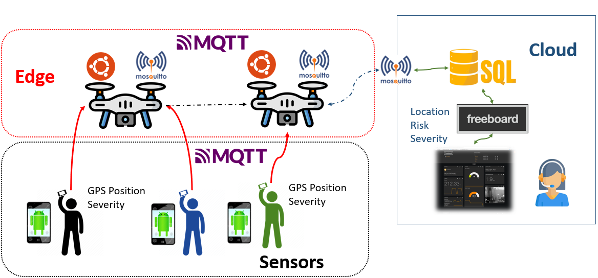
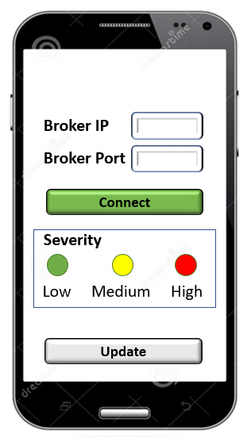
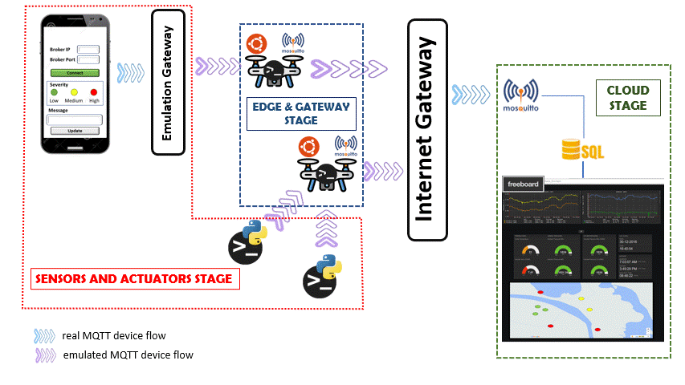
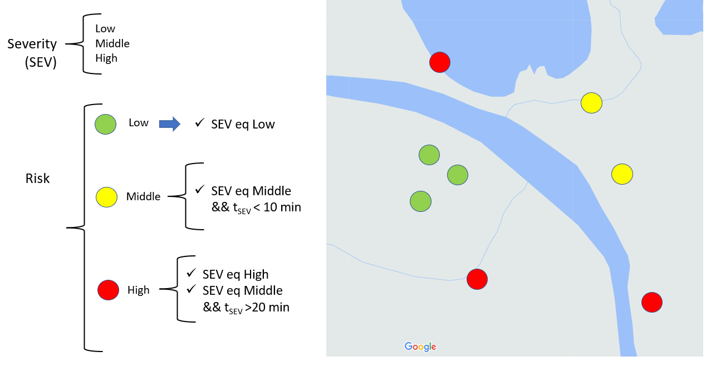

## 💡 Solution Description 

The problem to be answered by the Project is providing an efficient and secure environment to send a distress message when a natural disaster occurs (in our case, the flood disaster situation). In the scenario, there are no telecommunication links to provide essential communication (voice and data) to the rescue teams. Consequently, it is required to be innovative. It uses the means existent in the community and by volunteers, for example, drones (see the video below), to provide communication resources and support the identification of hazards.

In the suggested scenario, victims in the flood area will have a smartphone with a rescue app, which enables the citizens to send their position continuously and when they are in danger (severity level message: high, medium, or low) as a simple text message (description of their situation), as it is presented in the following Figure. To provide communication support (enabling victims’ messages to flow to the Crisis Management Center - CMC), drones flying in the crisis area intercept the message and forward it to other drones until the message arrives at the CMC (given that an individual drone does not have communication for the whole disaster area). The CMC data is processed and aggregated, and a dashboard is provided for the operators to plan the rescue operation efficiently.

An example of the suggested app is shown in the following Figure.

The approach used to implement the solution is through an Internet of Things (IoT) architecture. IoT is an advanced automation and analytics system that uses artificial intelligence, sensors, networking, electronics, cloud messaging, etc., to deliver complete systems for products or services. As presented in the Figure below, you use a four-stage architecture to design the solution and make it easy to understand and interoperable. 

An essential entity in this environment is the [MQTT broker](http://docs.oasis-open.org/mqtt/mqtt/v3.1.1/mqtt-v3.1.1.html), implemented using [Eclipse Mosquitto](https://mosquitto.org/). Eclipse Mosquitto is an open-source (EPL/EDL licensed) message broker that implements the MQTT protocol versions 5.0, 3.1.1, and 3.1. Mosquitto is lightweight and suitable for all devices, from low-power single-board computers to full servers. The emulation node runs in the [bridge mode](http://www.steves-internet-guide.com/mosquitto-bridge-configuration/), which means it receives the message from the user nodes and forwards them to the primary Broker, which is in the Application Server (real server located in the cloud).

There is an application server that provides features to Command-and-Control (C2) users. It is a node that runs on a server box (Linux or Windows). This server has a Mosquitto broker, which receives all messages from the bridge ones and persists them in an SQL database. Also, it has a dashboard that organizes the data in a helpful format, presents the information in a map visualization, and calculates the Risk KPI (explained in the text). We suggest the use of [Freeboard.io](https://freeboard.io/) or [Grafana](https://grafana.com/oss/grafana/). Freeboard.io and Grafana are open-source dashboard projects with optional hosted subscriptions, are easy to integrate with various data sources, are ready for production, and are very well designed. Freeboard is a dashboard, and Live Objects can serve as an API for data sources.

Check the following figure to better understand the architecture and how it correlates with the previous stage model. You can see that all user nodes represent the sensor and actuator stage; however, it is essential to note that these nodes only send messages (they are sensors). Also, you have the gateway and edge stage. As you can see in the picture, all messages sent to the MQTT proxies are redirected directly to the cloud stage.

Finally, architecture has the cloud stage. In this stage, the principal Mosquitto broker is responsible for receiving all messages from the bridge brokers (drones), converting them to SQL format, and persisting into a SQL database. Another service in the cloud is the dashboard. The suggested solution is Freeboard.io which queries the required information from the SQL database and prints them in a helpful dashboard for the rescue teams.

As we cited, the dashboard needs to present helpful information, including the geo-information about the user nodes as the classification (KPI), calculated based on the severity sent. The formula to calculate the KPI is shown, and the color code is presented in the dashboard, which you can see in the following Figure.

As you commented, each node sends its state using MQTT to the bridge broker. The conditions can be _low, middle, or high_; where high, the **individual is in danger**, and low, **he is safe**. The dashboard needs to compile this data and, using the formula presented in the previous figure, define the **risk situation** and **colorize** the node representation in the map.

### ➕ Support Material 

Aiming to help the students in the implementation of the final project, a set of support material were developed. Here you have the complete list with some explanations, hands-on, and examples of configuration files:
- [Client Stage - Android Device](templates/android/ANDROID.md)
- [Gateway / Edge Stage - Mosquitto Broker](templates/mosquitto/MOSQUITTO.md)
- [Cloud Stage - Python MYSQL x Mosquitto Broker Integration](templates/cloud/MYSQL.md)
- [Cloud Stage - Dashboard](templates/cloud/DASHBOARD.md)
- [Infrastructure - Mininet-Wifi](templates/mininet/MININET.md)

